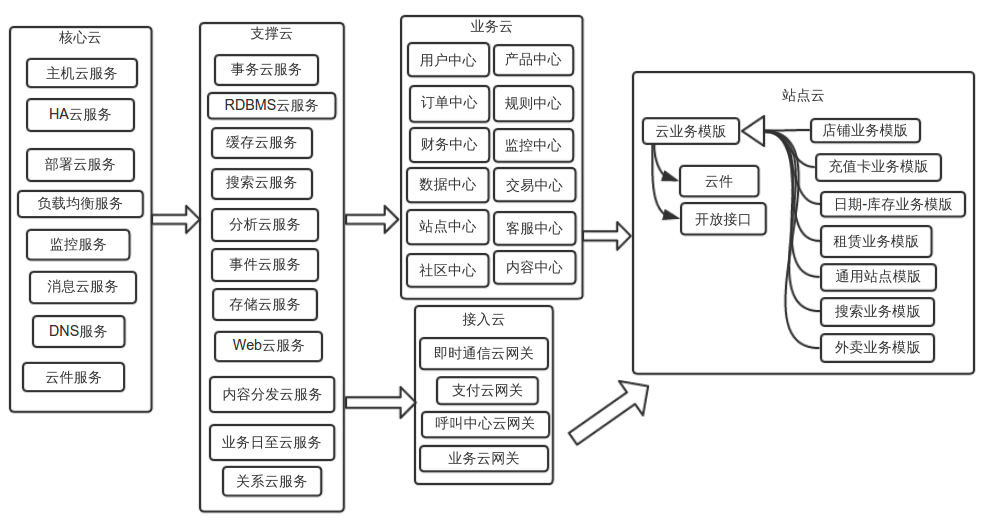
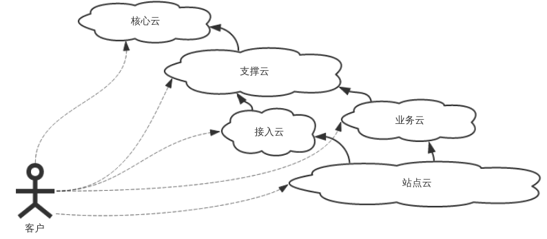
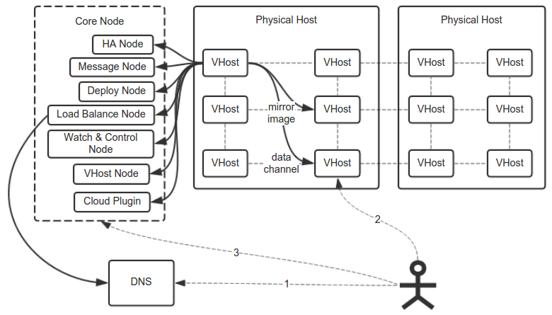
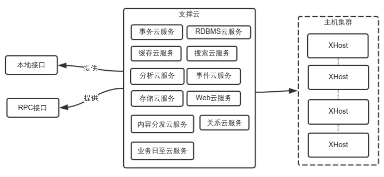
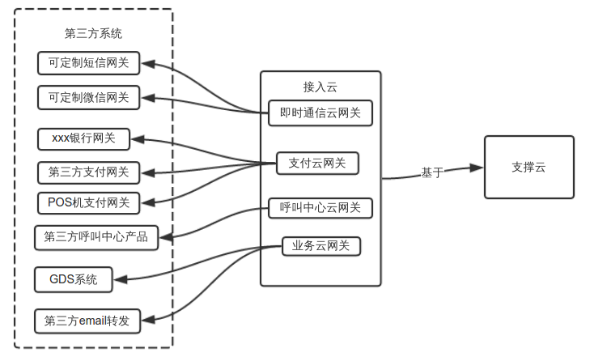
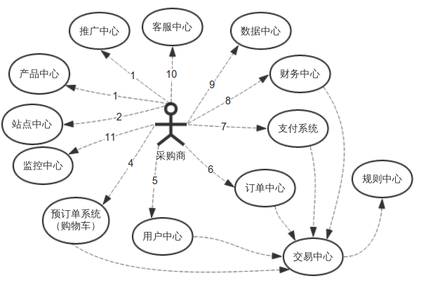
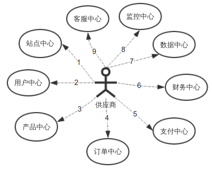
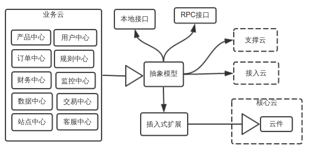
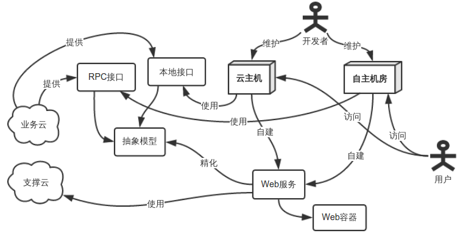
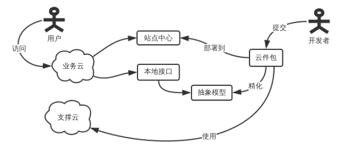

#AaaS（云交易框架）简介
1. ##前言
   【云】的概念在本文中意味一种“对大量【计算资源】进行切分和管理并在使用时实现【按需分配】和【高可用】”的技术和实现。
   
   本文从整体上构建一个可承载【任何大型云计算站点】的框架，并简要介绍了面向【云交易平台】的构建方法，以及怎么快速的构建【基于已有业务模式】的【云交易平台】的方案。
   
   对比已有的【PaaS】【SaaS】以及【IaaS】等概念，本平台从业务模式上可以被称之为【AaaS（All as a Service)】
   
   限于篇幅，本文主要作用是对【整个平台】的【整体架构】的设计和实施提供指导，只提供少量的【实现细节】。
   
2. ##四层云端结构
   
   
   将整个平台从下往上切分为四层，分别命名为【核心云】【支撑云】【业务及接入云】【站点云】。
   
   1. ###核心云
      【云计算】的基础层，它基于【硬件虚拟技术】和【云计算技术】，由大量的【物理主机】和【云主机】构成，并提供驱动这些主机进行工作的【必要组件】，比如【监控】【消息发送】【负载均衡】【日至同步】【快速部署】【磁盘内存镜像】等，这些组件可以使【主机】的计算资源得以切分和管理并且根据【主机】上运行的【服务】的需求进行分配，并使得【主机】上运行的【服务】在一般条件下可以提供【7*24小时不间断服务】。
      
   2. ###支撑云
      任何业务除使用自己【主机上的资源】外，为了快速高效高并发的处理【业务场景】，还需要使用到其他使用【云技术】的【组件】，比如【高速缓存】【事务处理】【快速搜索】【数据分析】【事件报告】【大数据存储】等，这些【组件】归类到【支撑云】中，这些技术的实现并不需要用到【硬件虚拟技术】，甚至不使用【硬件虚拟技术】可以得到更高的性能。
      
   3. ###接入云
     有些系统需要使用【第三方系统接口】的功能，比如【支付】【即时通讯】【电话呼叫】【GDS航班查询】等，这些【第三方系统接口】往往不会分配太多的计算资源给你，并且在调用过程中会出现由于各种原因而导致的异常。将这类资源放入【资源池】并提供高度可靠的【云接口】，再根据使用情况分配资源，这就是【接入云】所完成的工作。
     
   4. ###业务云
      如果对已有的【B2C】【B2B】【C2C】站点进行【高度的抽象】，可以形成一系列的抽象模型，这些模型有着高度共通的地方，那么将这些模型用已有的【核心云】【支撑云】【接入云】实现出来，组成一系列的【服务中心】，这些服务中心就是【业务云】，由于这些服务中心构建在已有的【云组件】上，他们的的计算资源可以确保被切分并分配，这样就可以简省和缩短未来【云站点】的研发过程。这种将大部分重要业务【云化】的方法，可以很大程度的减少对巨大【运维团队】的依赖。
      
   5. ###站点云
      软件研发是一个非常复杂的过程，相当多的【研发团队】不具备构建【大型高可用服务站点】的能力，这样的团队利用【业务云】来构建【大型的云站点】仍然有一定的困难。那么这最后一公里，我们可以用多个已经【成熟的站点方案】，提供一系列的【站点模版】，让这些模版可以自动的生成【大型业务产点】，比如【店铺业务】【充值卡业务】【旅游站点业务】【新闻发布业务】，这就是【站点云】，这些模版除了提供成熟的大型站点自动构建之外，还提供用户对站点的【个性化定制】和【第二次开发】以及【对外开放接口】的方案。租赁这类的产品，你可能只需要准备寥寥几个【开发人员】就可以支撑起大规模的【业务团队】。
      
3. ##四层云端结构与客户的关系
   
   
   每个【云层】对外都是对【各种服务】和【计算资源】打包的产品来提供的，【核心云】和【支撑云】提供的是技术组件，是基础产品，【接入云】和【业务云】以及【产点云】可以看成是将基础产品以各种形态打包的高层产品，是业务组件。
   
   而不管是【基础产品】还是【高层产品】都是是根据所需计算和存储资源来计费的。
   
   用户可以在各个【云层】根据需要购买或者租赁【产品】以及产品所需的【计算资源】，这些产品可以根据客户需要【自行整合】。
   
4. ##核心云
   
   
   这一层涉及【云计算】最基本的【计算资源】和【网络资源】的管理与分配，并定义构建【云节点】所需要的最基本的【组件】：
   下面描述的并非对外产品，而是【核心云】技术构成，对外产品应该是其子集。
      1. 【云主机】将多个机房中多个【物理主机】切分为更多的【云主机(VHost)】，并提供【管理界面】，这些【云主机】的表现形态跟【真正的独立IP的物理主机】一样。并且可以根据需求，快速的配置需要使用的【计算资源】和【网络资源】。并在这一层进行【硬盘快照】，将这些【快照】冗余到多个主机上，如果某台【物理主机】宕机之后，其上的【云主机】可以在其他的主机上继续运行,其对外对内【特征】没有任何变化。
      2. 【负载均衡服务】可以将网络传输层或者应用层对【一台主机】的访问请求分散到【多台主机】上。
      3. 【DNS服务】可以使用户自行配置【主机域名】实现对多机房的主机设置统一【域名入口】，并且【主机状态】可以反馈到DNS服务中，根据【当前状况】自动进行设置。
      4. 【监控云服务】可以不间断的对【物理主机】以及【云主机】的当前状态进行监控。
      5. 【部署云服务】可以将【软件包】根据【预设需求】部署到目的主机上并执行重启【过程】，并在必要时可以【自由回滚】到某个状态，这个服务还提供程序的分发以及加载，以适应【云端架构】。
      6. 【HA云服务】提供API，将任意一批相同的【主机上的服务】通过【分布式一致性算法】包装成一个统一的服务，并通过【容错】和【均衡】实现高可用。
      7. 【消息云服务】提供程序间彼此交互的通道，又可以称之为【消息云总线】，对比传统的【消息总线】，他基于对【网络资源】和【通信资源】的管理和分配，提供各组件之间高速的可靠的通信渠道。
      8. 【云件服务】可以满足【已完成的程序】基于【OCP原则】的【第二次开发】或者【个性化定制】，将传统的软件中【插件】这个概念扩展到云端，同一个【云件】会在各个主机上根据需要被加载和运行，而【云件服务】管理了从【组件获取】到【加载运行】整个过程。
      
5. ##支撑云
   
   
   这一层提供的是进行【云计算】所需的【技术支撑】，包括【存储】【查询】【分析】【应用】等方面的内容。
   
   下面描述的并非【对外产品】，而是【支撑云】的技术构成，【对外产品】应该是其【子集】。
   
   这些服务都需要确保，能根据需求扩展【计算资源】和【存储容量】以及【不间断运行】。
   
   这些服务大多是构建在真实【物理主机】上并且是【云化】的，这样的话可以提供【更高的性能】。
   
   这些服务都是以【本地接口】和【RPC接口】的形式提供给用户使用的。
   
      1.【RDBMS云服务】将【关系型数据库】像【云主机】一样在多台【物理主机】上进行【冗余】以提供【高可用服务】。
      2.【缓存云服务】根据真实所需资源，提供【K-V类型】的【高速缓存】。
      3.【搜索云服务】根据用户提供的【数据源】进行【分词索引】并提供【查询方法】。
      4.【分析云服务】给用户提供基于【大量数据】的【分析】和【展示】的工具。
      5.【事件云服务】通过监控任何已购买的【其他服务】上的【状态变化】和【数据变化】，并根据用户提供的【规则】触发某个【定制的事件】，这些事件可以是系统提供的或者是自定义的【云件】。
      6.【存储云服务】可以使用户能够在系统中存储【大量数据】或者是【大型文件】。
      7.【Web云服务】可以使【Web容器】【云化】，使用户提供【服务组件】后即可【对外服务】，不用关心【具体部署过程】，由于需要具备【隔离性】，这可能是【支撑云】中唯一必须使用【硬件虚拟化技术】的服务。
      8.【事务云服务】专门提供安全高效高并发的【事务处理】和【事务存储】服务，这是【交易系统】的核心服务。
      9.【内容分发云服务】专门提供安全高效大批量的【数据分发】和【数据同步】服务，这是建立【最终一致性】【数据冗余】的核心。
      10.【关系云服务】专门提供高效的两组【规模较大】的【数据】之间【相互关系】的【建立】【存储】和【查询】的服务。
      
6. ##接入云
   
   
   这一层提供的是，对【第三方接口资源】或者是【人力接口资源】的管理和分配，包括【即时通讯】【电话寻呼】【业务网关】等。
   
   是以【支撑云】为基础提供的服务，因为【第三方资源】极为有限，所以进行【分时】或者是【分频】是技术基础，并且需要确保接口是高可用的。
   
      1.【即时通讯网关】是对【短信】或者【微信】类型的【即时通讯接口】的封装，使多个【接入点】可以被【分频】或者是【分时】使用。
      2.【支付云网关】对【银行】或者是【第三方支付接口（支付宝）】以及【POS机】等接口的封装，并需要确保所有的行为都是【安全的】并且【可审计】的。
      3.【呼叫中心网关】有很多业务公司需要【呼叫中心】进行【售后服务】，那么提供对多个【呼叫中心产品】的对接也是有必要的。
      4.【业务云网关】这里的可能有很多，比如【GDS系统】，【email转发】等。
      
7. ##业务云
   对早已成熟的【业务模型】进行抽象，并依托于【下层云系统】进行【云化】，使每个【服务中心】可以根据需求进行资源分配。
   
   作为举例，我们先对复杂的B2B/B2C系统进行初步梳理。
      1. ###典型【B2B/B2C】系统服务
         
         
         
         
         
         
      2. ###【业务云】构建方式
         
         
         1. 对各【服务中心】抽象出【领域模型】。
         2. 用【支撑云】【接入云】实现该【领域模型】的存储和组件。
         3. 这些组件应该对外实现【本地接口】以及【RPC调用接口】以方便【各环境开发者】调用。
         4. 这些组件应该需要用【核心云】中的【云件】提供【插入式扩展】，实现第二次开发。
      3. ###高级租用者
         本节讨论采用业务云建立站点的方式
            1. ####自建站点
               
               
               采用这种方式的开发者，需要自己管理多个【主机】或者【云主机】，并自行处理其上【web服务】的部署。
               优点在于可以使用自己熟悉的【Web容器】，适合【少量访问者】但是需【大量计算资源】的情况。
               缺点在于对【Web容器】的部署和其中【Web服务】的部署需要一定的【运维工作量】。如果站点入口并发过大，需要多台主机的时候，需要自己处理【负载均衡】【系统冗余】等情况，这无疑也增大了【运维成本】。
            2. ####云端建站
               
               
               采用这种方式的【开发者】只需要开发【云件包】，并将其上传到【站点中心】，以及配置【并发量】【实例数】等参数，然后等待部署完毕就可以了。
               优点是可以非常快捷的进行部署，基本无运维压力，进行各种资源的扩充也很容易。
               缺点是必须用【云件包】来发布，不是常规的【web容器】，为了解决这种问题，我们可以特别支持【用常见web容器部署包】,方便已有网站的迁移。
               
8. ##站点云
   这是一种快速创建【高性能常规站点】的技术，平台内建置入一些【站点模版】，这些模版包括常见的一些【业务站点】的【整套服务】，通过模版可以快速生成【整套站点】,同时可以进行【个性化定制】，对于一些开发力量薄弱但以业务见长的团队，可以以非常少的研发代价获得支持【大业务量】的【标准网站】，同时可以通过【云件】和【开放接口】进行扩展，而这种扩展需要的开发资源非常少。
   
   实现的方式是：
      1. 内建一套【模版工厂】，通过【业务模版】生成可以进行【云端建站】的【云件包】。
      2. 不停的开发各种常用【业务模版】。
      3. 【业务模版】需要暴露【云件接口】供第二次开发。
      4. 【业务模版】需要暴露【开放接口】供第三方系统访问。
      5. 开发者选择对应模版并输入初始化性能参数之后可以获得对应性能指标的【整套站点】。