#Naruto HA云服务

1. ##前言
   本文的目的是从【原理】和【实现】上描述一个以【分布式一致性算法】为技术基础的【基础构件】，通过这个构件可以将大多数服务分布到多台主机上，以实现对该服务的【弹性部署】【容灾处理】以及【负载均衡】，这个服务是【云交易平台】软件部分的最基础的组件之一。
   
   本文先从【系统】这个概念开始描述，提出【构件】这个最基本的可【量化管理】的【计算单元】，并介绍了【构件】之间【事件交互】的【并发驱动模型】。紧接着介绍【Naruto构件】内部实现的四层模块【链路模块】【复制模块】【分片模块】【Naruto模块】。
   
   由于从头实现这样一个服务，代价是比较大的，所以本文最后给出利用【开源工具】进行快速开发的【替代方案】。
    
2. ##架构原则

   1. ###基本构成
      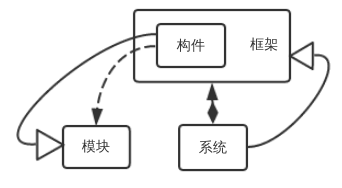
      
      【云交易系统】里面所有的服务的【计算资源】都是可以【弹性伸缩】的，那么怎么对一个服务的【计算单元】进行【管理】以及【监控】【维护】是一个问题，在本文中：
      
      1. 【模块】是可以被【直接复用】的【程序语言级别】的【软件模块】。
      2. 【构件】代表一种可【管理】以及可以被【复用】的【计算单元】，它是由其他【模块】通过第二次开发提供【特别接口】的【模块】。
      3. 【框架】由多个【构件】组成，并具有对【构件】进行【管理】的【分布式接口】。
      4. 【系统】是提供【人机界面】对【框架】进行【管理】和【维护】的特别的【框架】。
      
   2. ###【构件】之间的关系
      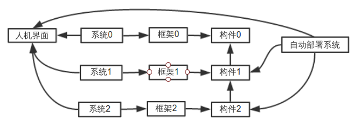
      
      1. 【构件】之间可以进行【嵌套包装】，但在【运行时】这两个【构件】属于不同的【框架】之下。
      2. 【自动部署系统】可以通过【量化的信息】进行【构件】的【部署】和【弹性伸缩】。
      3. 不同的【系统】可以共用同一个【人机界面】进行指标的监控。
      
3. ##并发驱动模型
   为什么要说【并发驱动模型】，因为这是实现【模块】的基础。【消息发送】和【事件触发】构成了【模块】的原始驱动力，并且是【系统】各组成部分【互相交互】的基础，根据经验，有两种【实现】可支持【大量】的【并发消息】和【事件触发】。
   
   1. ###事件驱动模型
      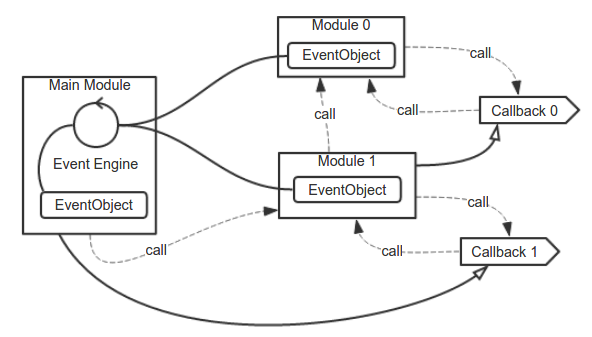
      
      【事件驱动模型】大多是基于单线程的，也就是说【主启动模块】必须实现或者加载一个【Event Engine】。 这个【驱动引擎】可以持有多个【EventObject】，并对【EventObject】中的【等待事件】进行管理，在必要时触发一个【Callback】。而作为【模块】必须要提供一个【EventObject】给【Event Engine】，如果一个【模块】引用另一个【模块】，那么可以采用【EventObject】【嵌套】或是【暴露】的方法。
      
      ####优点：
         1. 由于驱动是【单线程】的，所以整个程序的运行没有任何【加锁】的必要，模型相对简单而性能高。
         2. 由于驱动是【单线程】的，整体【CPU资源】很好估算。
         
      ####缺点：
         1. 虽然这个模型可以扩展到多个线程上，但一旦这么做，模块之间的交互将变得非常的复杂而容易出错。
         2. 除非系统是严格【规划过计算资源】的，否则你将不会享受到多处理器的优点。
         3. 各种【事件回调】会导致代码非常复杂以至于很难调试。
         4. 所有的【模块】必须要依赖统一的【Event Engine】和【Event Object】的实现，这样就限制了【第三方模块】的引入（虽然可以通过增加中间层来实现）。
         5. 由于共享同一个线程，因此每个Callback内的操作不可占据过长的时间，否则会卡死【Event Engine】
         
      因此，这个模型可以作为模块内部的并发驱动。除非你使用的【编程语言】是内置【Event Engine】的，否则作为【模块】之间的【并发驱动】是不合适的。
      
   2. ###过程驱动模型
      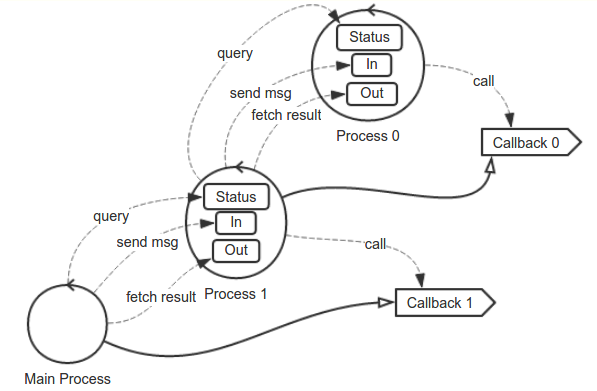
      
      这个模型好像没有统一的称谓，所以自创了一个，本文中称为【过程驱动模型】。
      
         1. 系统的基本单位是Process，每个Process代表一个模块，Process提供三个同步接口【Status】【In】【Out】以及一个回调接口【Callback】。
         2. 【Status】可以查询Process当前的状态，包括业务状态和运行状态。
         3. 【In】向Process发送命令，每个命令可以改变Process的状态。
         4. 【Out】从Process取回命令导致的结果集，这个结果可以对应每一条In的命令，也可以是多个In共同导致的结果。
         5. 【Callback】不会返回具体的结果值，也无法预计他的调用线程，它仅仅作为一个Process状态改变的通知，如果调用方是时钟驱动的，那么【Callback】不是必须的。
         6. 多个【Callback】和【Out】可以采用一个Wait对象聚合起来，这个Wait对象可以管理一大批Out并在Callback触发时返回Out里面的内容。
         
      ####运行模式：
         1. 调用方将监听【Callback】。
         2. 调用方向In发送指令。
         3. 调用方通过时钟或者是【Callback】来驱动去获取Out里面的结果，并根据结果进行处理，在需要的时候可以通过Status接口查询想要获取的状态，比如一个状态变化版本号。
         
      ####优点：
         1. 几乎所有的【主要接口】都是同步的，实现业务模型将非常简单，而【Callback】的存在仅仅是为了触发下一轮同步接口的调用，在某些情况下可以取消。
         2. 每个Process不需要统一的驱动，实现方式不会互相影响。
         3. 三个【同步接口】是Process自己提供的，Process甚至可以是【异构的】，只要转换三个【同步接口】就行。
         4. Process之间有些类似于【流式处理结构】，能更好的进行【性能优化】。
         
      ####缺点：
         1. Process接口实现起来有一定的复杂度。
         2. Process内部可能涉及【第三方工具】或者是【复杂的线程调用】，这种情况比较难以估计【cpu资源】，可以通过一些【应用容器】实现。
         3. Process太多的时候【线程】也会比较多，【线程之间切换】会消耗掉一部分计算资源，如果【编程语言】可以支持类似与纤程之类的技术，就能避免掉这个问题。
         
      因此，如果将【过程驱动模型】的复用框架实现出来，或者使用原生支持【纤程】等类似技术的【编程语言】，我们就能够发挥此模型的优势了。
      本文中大多数模型的对外接口都是按照【过程驱动模型】的形式设计的。
      
4. ##整体框架
   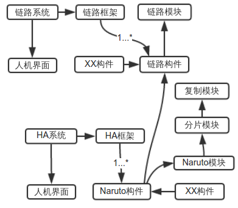
   
   1. ###四层模块
      这些模块都是开放的，并提供可被复用API。比如2和3里面，其中的网络通路完全被抽象出来，让使用者决定。
      
         1. ####链路模块
            构建在tcp/ip协议基础上，提供容易【配置和使用】的【点对点对等网络】的通路和管理接口，弱化CS概念。
            
         2. ####复制模块
            提供管理多个【虚拟节点】并在他们之间【同步副本】的功能，使多个【虚拟节点】对外可以被看作为不会损坏的【单个节点】。
            
         3. ####分片模块
            维护一个状态，这个【状态】维护一批【虚拟节点】根据【一定的策略】对【目标域】进行【分割】的信息，是【Naruto模块】分配节点的依据。
            
         4. Naruto模块
            整合【复制模块】和【分片模块】实现【高可用集群】的抽象功能。
            
   2. ###两层构件
   
      1. ####链路构件
         基于【链路模块】而制作的构件，所有的构件都处于同一框架和系统中，可以通过【监控界面】进行监控和管理。
         
      2. ####Naruto构件
         基于【Naruto模块】并实现以【链路构件】为通路的的构件，同样也有一个Naruto框架和系统，可以通过【监控界面】进行监控和管理。
         
5. ##链路模块(Servers)
   提供【对等通路】和【虚拟节点】以及对他们的管理的模块。
   
      1. ###功能简叙
         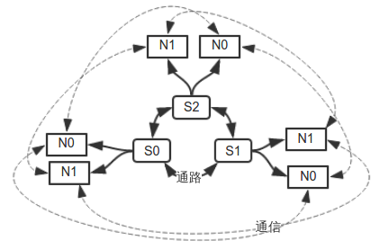
         
         每个Server（Sn）下面有多个Node（Nn），两个Server之间的连接接是【服务内部管理的】，对Server的使用者来说没有【Client-Server】的概念，并且可以设置两个Server之间有【一条】或者【多条】通路互达，通路是【双向】的，被链接Server的【同名Node】才可以互相通信。
         
      2. ###对象
         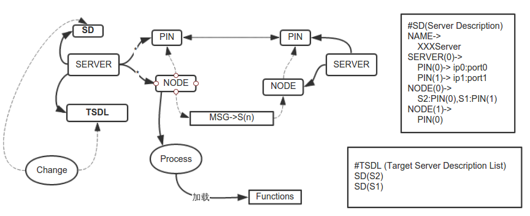
         
         每个Server可以有若干个Pin和若干个Node，两个Server之间的一对Pin可以构成一条【双向通路】，两个Server之间只有【同名的Node】才能通过通路【互相通信】。Server有一个【描述表（SD）】，SD里面记录Server的Name，Pin，以及Node的路由信息。Server还有一个【TSDL表（目标Server描述表）】，这个表里面包含【本地Server】可能会连接的【远程Server】的SD。
         
         Server是否能与另一个Server创建一条通路并且使用那两个Pin来通信，是根据下面两条规则来的：
            1. TSDL表中是否有另外一个Server的【描述信息（SD）】。
            2. 这两个Server是否有【同名的Node】。
            3. 两个Server上的Node是否配置有【Pin路由】来建立通路。
         
         满足上面三条规则的Pin之间会建立一条通路。
      
         Server的SD和TSDL可以动态进行设置，只要满足上面三个条件就会【动态创建】通路。
      
         如果Server对象处于同一台Host上，Server之间的通讯可以采用其他效率更高的方式，比如共享内存。
      
      3. ###接口
         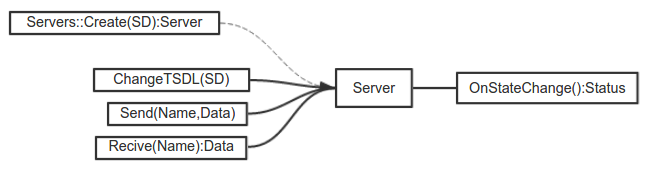
         
         采用【过程驱动模型】，可以将接口设计成下面这样：
         
            1. 用Nodes::Create(SD)来生成一个Server对象。
            2. 用Server.ChangeTSDL(SD)用来动态更新TSDL。
            3. Server.OnStateChange()回调接口可以捕捉到Server状态的变化，比如SD更新，是否可以Send，是否可以Recive。
            4. Server.Send发送信息。
            5. Server.Recive获取已经收到的信息。
      
6. ##复制模块(Repls)
   【复制模块】是构建在一个【抽象的网络层】之上的【分布式一致性复制算法】模块，通过【复制模块】的第二次开发，可以很快的组成一个可以【弹性伸缩】的【动态唯一Leader集群】，这个集群的【对外状态】保证总是一致的。集群的Leader是集群自己选举出来的，Leader是集群的唯一【命令接受者】。本文中的【一致性算法】主要是参考【raft】。
   
   1. ###功能简述
      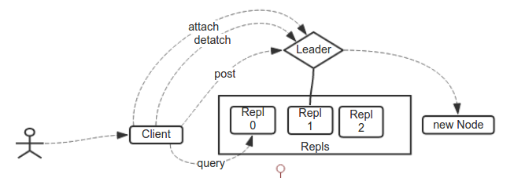
      
      多个【Repl对象】运行在不同的主机上，这些Repl组成【Repls集群】，同一时刻【整个集群】中最多只会有一个【有效的Leader】。命令需要被提交到Leader上，一旦【提交成功】，该命令必定会被所有的Repl同步到并保证【命令同步顺序】，在任意一时刻只要【大多数Repl】还在工作，所有【已经提交的命令】都不会失效。Repl也可以动态的【加入】和【移出】集群。值得注意的是Repls对外是作为【一个整体】来【提供服务】的，因此需要有一个Client提供给使用者，Client可以屏蔽对【查询Leader的过程】，并缓存结果。对使用者来说，就像访问一个服务一样访问一个集群。
      
   2. ###对外表现形式
      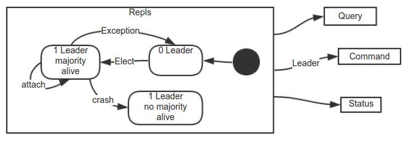
      
      Repls通过Client表现出对外一致的形式，通常表现为【两个状态】：
      
      1. 可用，只要【大多数Repl】存活，并且有一个【有效Leader】，那么功能就【可用】。
      2. 不可用，如果没有【大多数Repl】存活，或者Leader没有被【选举出来】，那么功能【不可用】。
      
      当没有Leader的时候，Repl们会发现这个情况，并通过【一致性算法】选举出Leader。
      
   3. ###时代唯一主角
      
      
      每个Repl设置一个【逻辑时间】本文称为【时代（era）】，当某个Repl的【内部Timer】超时的时候，era会加1，并且会扩散给跟他通讯的其他Repl，【较新时代】的Repl不会接受【较旧时代】的Repl发送的信息，【相同时代】的Repl称之为【处于同一时代】，每个时代中【最多】产生【一个】Leader，Leader的产生必须通过大多数Repl的同意，并且Leader的操作也需要同步给【大多数Repl】才算是完成。
      
      因此，同一个真实时刻可能会存在不同的Repl处于【不同的时代】，而只有拥有【大多数Repl】的【时代】所产生的Leader是有效的，一旦某个Repl超时，他将属于【新的时代】，从此不再接受【旧时代】Leader的消息，直到他将【大多数Repl】拉入这个较新时代后，再通过选举过程确定这个时代的主角。
      
   4. ###基于Log的操作
      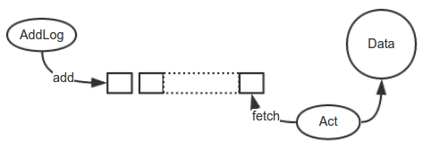
      
      Repl并没有【定义】所复制的是什么，而是定义了复制的【途径】，我们认为【Repl所代表的对象】具有下面的特征:
      
      1. 其所有的变化都是由【外界因素】造成的。这些【因素】是【顺序发生】的并可以被记录下来。我们在本文中称这些【被顺序记录下来的因素】为Log，
      2. 【两个不同的Repl】只要拥有【相同的初态】以及【相同的Log】，那他们在这些Log【发生作用】后将处于【一致的状态】。
      
   5. ###Logs的结构
      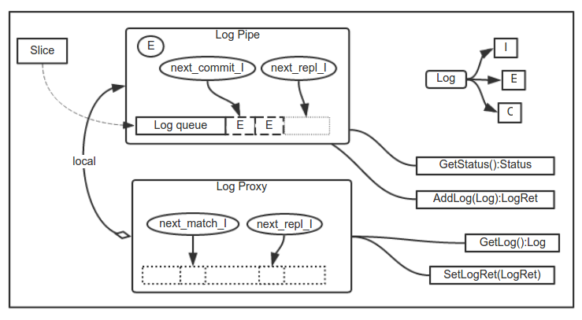
      
      Logs是将【对Log的操作】抽象出来，专门用来【管理】和【操作】Log的【子模块】。
      
      1. ####Log对象
         每个【Log对象】都会记录下面几个属性：
         
         1. 所在Log队列的【序号I（Index 第几个）】。
         2. 这个Log是在那个【E（era）】的时代生成的。
         3. 【内容C（Content)】，内容可以是【Repl状态内容】或者【使用者操作内容】,除此之外C可以是【空】，代表【试探Log】。
         
      2. ####【Log Pipe】对象
         承载Log对象的主体，包含下面一些属性。
         
         1. E代表当前era值。
         2. 【Log Queue】 是存储Log的队列，这个队列只能往后追加，如果往回写，【写入点】之后的内容【将被去除】。同时，这个Queue可以根据某个【分片原则】由【多个Queue】组成的。
         3. next_commit_I是下一个需要commit的Log的Index值，commit意为改Log已经被系统【成功接受】，不会丢失。
         4. next_repl_I是下一个需要写入【Log Queue】的Index值，Queue的追加都是从这个值开始的，每次写入后都需要加1。
         5. 【GetStatus()方法】返回当前【Log Pipe】的状态。
         6. 【AddLog()方法】作用是【追加】一个Log，并返回【追加】的结果(LogRet)，这个结果会被返回给对方的【Log Proxy】。
         
      3. ####【Log Proxy】对象
         是远程【Log Pipe】在本地的一个映射，他需要【关联】本地【Log Pipe】，并根据映射的状态和本地【Log Pipe】的状态给出【下次需要同步】给远程【Log Pipe】的Log。
         
         1. 【next_match_I记录】是已经【确认】跟远程【Log Pipe】一致的Index。
         2. 【next_repl_I记录】下一个【可能】需要复制给远程【Log Pipe】的Index。当next_match_I跟next_repl_I【不重合】的时候需要发送【C为空的Log对象】，用来试探真实next_match_I的位置。
         3. 【GetLog()方法】根据【Log Pipe】和【Log Proxy】的状态，返回【需要同步】或者【试探】的Log对象。
         4. 【SetLogRet()方法】根据LogRet设置【Log Proxy】的状态。
         
         这个模型所有的【返回值】都是针对【单条Log】的，在实际【实现的时候】可以优化为【多条Log】。
         
   6. ###Repl对象
      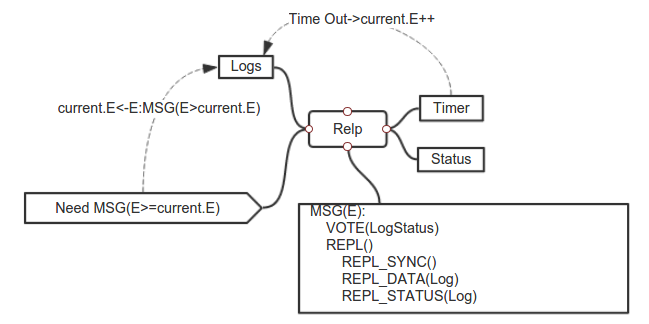
      
      每一个【Repl对象】都会连接其他【Repl对象】，并【驱动】Logs来完成【单个节点】的【操作复制】。
      
      1. ####消息（MSG）类型
         【消息】是一个【继承结构】，【子消息】将继承【父消息】的特点。实际发送的都是【子消息】。
         MSG：消息的【总父类】，所有的其他消息是他的【子类】，他会携带一个【E（era）值】,所有收到这个消息的Repl会过滤【小于本地E值】的消息，或者使【本地E】赋值为【大于他的E】。
         VOTE：选举消息，将携带【本地Log】的Status作为【选举凭据】。
         REPL：复制消息，他的子类型可能是【空】的复制消息，或者是带有【使用者Log】的复制消息，或者是记录【Repl状态改变】的消息。
         
      2. ####Timer
         这个时钟一旦超时，E加一，Relp进入【选举状态】，这个时钟会被Leader发送的REPL消息所重置。
         
   7. ###Repl的【状态切换】
      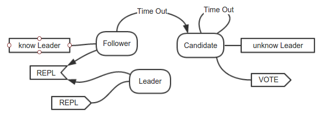
      
      1. ####三个状态
         本文中的【复制模块】是参考【raft算法】设计的，因此【Repl的状态转换】几乎跟【raft】一样分为【Follower】【Candidate】和【Leader】三种状态，下图说明几个状态之间【切换】的【条件】。
         
         1. 【Leader】状态，说明该Repl已经是他【当前时代】的Leader，同时不受【Time Out】影响，并发送【REPL消息】将自己的Log同步到其他的Repl上。
         2. 【Follower】状态，该Repl知道在他【当前时代】谁是Leader，并接受Leader的【REPL消息】同时【重置Timer】，他【Time Out】后成为Candidate状态。
         3. 【Candidate】状态，选举状态，他【不】知道【当前时代】的Leader是谁，同时他在积极【发送VOTE消息】选举【自己】为Leader，【Time Out】后E加1并【保持】Candidate状态。
         
      2. ####VOTE消息
         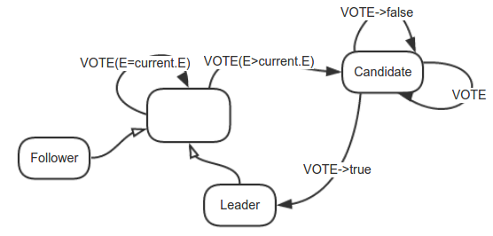
         
         【VOTE消息】是处于【Candidate状态】的Repl发送的，用来【选举自己】成为他【本身时代的Leader】的消息。
         
         1. 如果【Candidate】发送的VOTE被【大多数Repl】接受，【Candidate】就将【自己】变成【本时代的Leader】，并开始发送【REPL消息】。
         2. 如果【Candidate】发送的VOTE没有被【大多数Repl】接受，那么【Candidate】直到【Time Out】之后再进入【下一轮】选举。
         3. 【Follower】和【Leader】收到【比他们时代大】的VOTE消息时，将自己先转换为【Candidate状态】再处理这个VOTE消息。
         4. 【Candidate】在收到【等于】或者【大于】他【自己时代】的消息时会进行【投票】并保持【Candidate状态】。
         
      2. ####REPL消息
         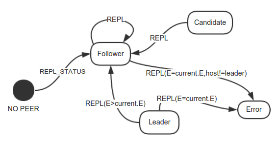
         
         【REPL消息】是Leader发送给其他Repl，用来【同步】自身Log。可以分为【使用者Data同步】和【Repl节点Status同步】。
         
         1. 任何状态下只要收到【大于自身E值】的REPL，就需要【立刻】转成【Follower】状态。
         2. 【Candidate】收到【等于自身E值】的REPL消息，需要转为【Follower状态】。
         3. 【Leader】收到【等于自身E值】的REPL消息，则表示整个集群【出问题】，程序【有bug】。
         4. 【Follower】收到【等于自身E值】并且【跟自己知道的Host不一样】的REPL消息时，也表示集群【出问题】，程序【有bug】。
         5. 有一个特殊的状态是【NO PEER】，【不接受】任何的REPL_DATA消息，【直到】收到一条REPL_STATUS时，转为【Follower】。
         
   8. ###Repl接口
      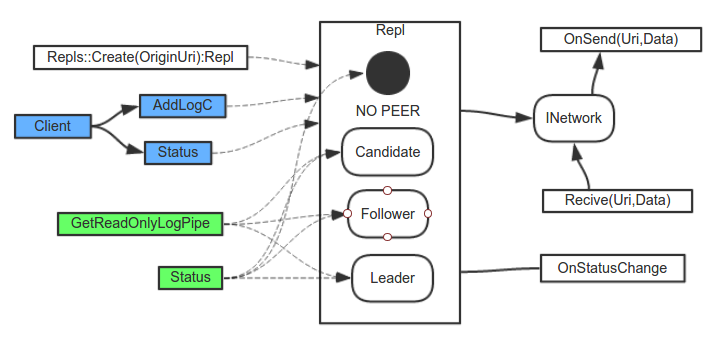
      
      1. ####Client（客户端接口）
         是Client端Api，提供内外【统一访问】的代理，使外界通过Client看,集群就像【一个整体】一样。
         
         1. （AddLogC方法）可以给集群传递一个【Log的内容项（C项）】，C【实际传送到】的是Leader节点。
         2. （Status方法）可以取得Repls的【当前状态】。
         
      2. ####GetReadOnlyLogPipe方法
         是Server端Api，可以取到【本地Repl】的【Log Pipe】，然后读取里面的数据。
         
      3. ####OnStatusChange回调
         是Server端【使用者】需要【实现】的【回调请求】，这个回调会通知类似于【Pipe增长】【Status改变】等消息。
         
      4. ####INetwork接口
         Client端和Server端共用【网络驱动抽象接口】，使用者可以提供INetwork的【具体实现】，INetwork通过【虚拟的Uri】来寻址，抽象出各个Repl之间的通讯。
         
7. ##分片模块(Partitions)
   
   虽然【复制模块】可以【保证】数据不会因为【小规模的异常】而丢失，但是一个集群【同一时刻】最多只有【一个Leader】，所以【写入负载】全部集中在这一个节点上，而【其他的节点】虽然可以承担【查询负载】，但是对于【写入负载】大的情况，会有相当大的浪费。这时应该将【处理对象】进行【分片】并【分布】在【不同的机器】上，这种情况本文称之为【分片】。
   
   1. ###两种【分片模型】
      涉及分片，【Object（处理对象）】必须要提供一个【SKey(Slice Key)】作为分片依据，根据【SKey与Object的关系】我们可以分为【两种模型】。
      
      1. ####标量分片模型。
         Object的内容和SKey【都】不会随着空间和时间而【改变】，任何【时候】任何【地点】Object的【内容】都【不会】变化。
         
         这种特点的Object需求的就是一个【纯粹的Cache系统】，类似于【一致性Hash】的或者是【Chord的算法】可以满足需求，而且是【完全去中心化】的系统，本文中对象通常都不会满足这个条件，因此不做叙述了。
         
      2. ####实体分片模型
         Object的SKey不会随着空间和时间的改变而改变，而【内容】可能【会】发生变化。
         
         这种特点的Object的分片是我们需要【着重讨论】的内容。我们设想用一个【Repls实例】维护【另一个集群】的分片状态，并管理新节点的【加入】和【移出】。
         
   2. ###整体架构
      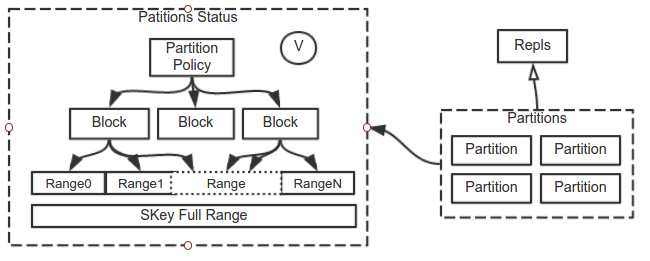
   
      1. Partitions是一个【Repls实例】，里面有很多个Partition，每个Partition都是一个【Repl实例】。
      2. 对于SKey的【值域（SKey Full Range）】，我们通过一定的【Range Policy】将他分为一个个的Range，Range的【个数】远大于系统可能【节点数】。
      3. Partitions通过一定的【Partition Policy】维护一个Status，它是Block到Range的映射表,每个Block持有的Range不会重复，但是所有的Block持有的Range加起来应该是整个【Full Range】。
      4. Status有一个【版本号V】，每次更新都会增加V的数值。
      5. 由于【分片模块】并不是【完全去中心化】的，因此【Range Policy】和【Partition Policy】可以采用的方法很多，本文不进行详细叙述了。
      
   3. ###Block到Range的映射。
      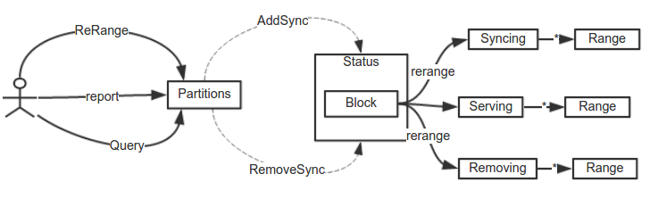
   
      1. Block都拥有一个名为Serving的【Range集合】，该Node应该提供这个集合的【对外服务】。
      2. 【使用者】可以查询Patitions集群获知当前集群的状态以及【某个SKey】对应的Block名称。
      3. 【使用者】可以执行【ReRange操作】重新对Node进行分片。
      4. 【Partitons】同步到ReRange这个状态后，将在Block下产生【另外两种类型】的Range集合，Removing和Syncing，【使用者】可以依据这【两个集合】进行数据的移动。
      5. 【Removing】是需要移动到【其他Block】的Range集合。
      6. 【Syncing】是需要从【其他Block】移动过来的Range集合。
      7. Serving,Removing,Syncing的意义在于对Range进行【标记】便于【查找】，有多种数据结构可以参考，比如【Hash Tree】。
      8. 【使用者】需要【不断】的向Partitions【报告】当前Block上Range的【实际状态】。
      9. 当Partitions发现【Block同步完成】时需移除Syncing和Removing。
      
   4. ###Partitions接口
      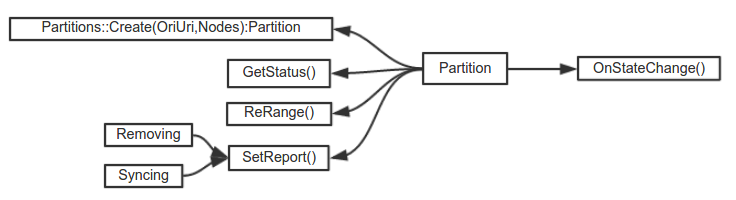
      
      1. 【GetStatus()方法】用来获取当前【部分】或者【所有Node】的状态，【使用者】可以根据【状态】进行处理。
      2. 【SetReport()方法】报告【某个Block】的Syncing和Removing集合的状态。
      3. 【ReRange()方法】用来【重新分片】。
      4. 【OnStateChange()回调方法】报告Partition的状态已经【发生改变】。
      
   5. ###HA层
      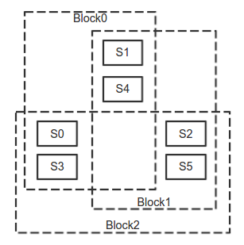
      
      上面描述的分片并不能保证【单个Block节点】的【可用性】，我们可以在【分片模块】上加一个【HA层】，将【单个Block】扩展到【多节点】上，以保证每个Block具有【容错性】。
      
      比如有【S0~S5】六台Server，要用他们来处理【值域】为【Full Range】的对象。如果用【一个Repls集群】的话，任何时间只有【一个Repl节点】可写，如果我们将【Full Range】切分为三个部分【Block0，Block1，Block2】，采用【三个Repls集群】将六台Server的【计算资源】切分，那么就有【三个写节点】以及【六个读节点】。如图所示可以看到，每个服务器资源都被两个Block所瓜分。
      
      更普遍的，如果切分都是【均匀】的，我们可以通过下面的标记，定义对【资源使用】进行【均衡】的情况，【H(S,P,R)】，S为所有Server的个数，P为分区的个数，R为每个分区所涵盖服务器的个数。通常，S是确定的，P和R<=S，P越靠近S分布越均匀，R越靠近S可靠性越高。图中的例子是H(6,3,4)。
      
      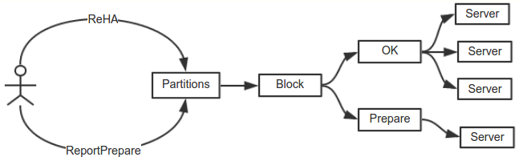
      
      HA层的修改也是类似于【两段提交】：
      1. 【使用者】发起【ReHA方法】。
      2. Partitions对Block下的Server根据【HA Policy】重新分配，生成一个【Prepare集合】，这个集合下包含需要【移入】或者【移出】的Server。
      3. Partitions接收到对应Server的【应答】，声明已经加入或者移出Block后，将Server【移入】或者【移出】OK集合。
      4. 由于使用【raft】这样不能【任意选择Leader】的算法，【HA层】不会给出【某个Block集群】下面【Leader节点】的选择，【Leader节点】由他们自己选择出来。
      
8. ##高可用模块（Narutos）
   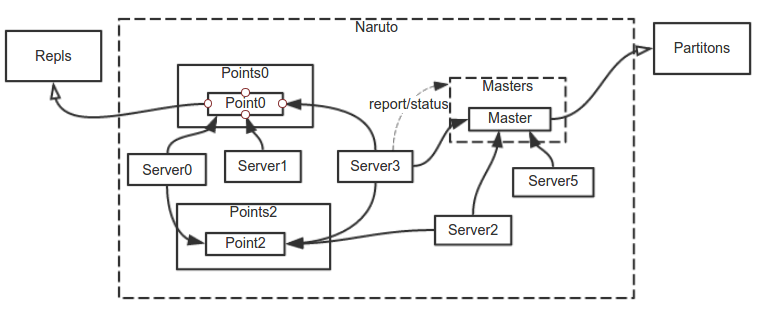
   
   【Repls】和【Partitions】模块按一定的策略【组合起来】，就可以提供【抽象的高可用】的功能。
   
   ###整合Repls和Partitions。
      每一个【Naruto实例】原则上由【三种类型】的Node构成，【Server】和【Master】以及【Point】，他们构成【Servers】【Masters】【Points】三个Node集群。
      
      1. Master是【Partitions的实例】，只有【所有Naruto节点】的【一个子集】上的【Master节点】会生效，这个【Masters集合】根据【当前Server】的情况对【目标域】和【Server】进行【HA切分】。
      2. Server只是一个【普通的Node实例】，他会读取Masters上对Server切分的情况，决定生成【Point节点】的【个数】和【编号】。
      3. Point是【Repl的实例】，是真正将Server的资源进行【切分】的节点，【相同编号】的Point组成【相同编号】的Points集群，Points对应于Partitions里面的Block，管理一个分片。
      4. Server同步Masters的状态后，可以成为一个【寻址节点】，Client端先向【某个Server】查询目标对应的Points，然后再向该Points请求【对应的数据】。
      5. Server需要收集【Points节点的状态】并【报告给Masters】，使Masters的状态【及时更新】。
      6. Naruto的【使用者】主要是操作【Point对象】来实现自己的【高可用功能】。
      7. 如果Master的数量【等于】Server的数量，很多同步的【网络请求】可以被【省略】，直接利用Masters内部Master之间【状态的扩散】代替。
      
9. ##构件
   上面描述了【Nodes】【Partitions】【Narutos】三个模块，这些模块是【平台无关的API】，可以用在【任何软件】中，为了在【云交易平台】中方便的【使用】【监控】与【资源管理】，需要将三个模块【封装成构件】，下面简要介绍三种【构件】和【模块】的关系。
   
   1. ###链路构件（Nodes Component）
      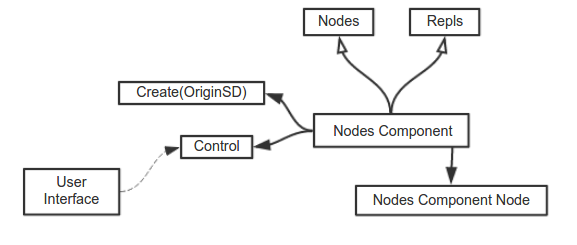
      
      这个构件用来将所有的【网络链路】集中【管理】【监控】和【维护】，【链路构件】除了使用【Nodes模块】之外，还依赖于【Repls模块】，因为【Nodes框架】本身也是一个集群，Repls在这儿承担【集群管理接口】的角色。
      
   2. ###复制构件
      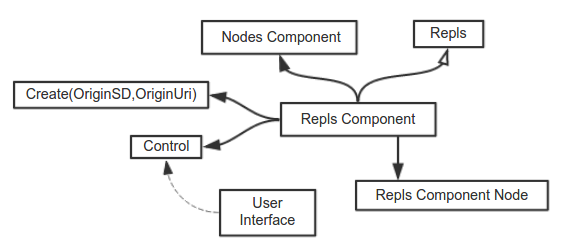
      
      这个构件包装【复制模块】，对【Leader的选举】和【操作的复制】进行【监控】和【管理】，除了使用【Repls模块】之外还需要使用【链路构件】作为【Repls模块】的【网络通路】，在这个框架中【复制构件】的【网络通路】和【复制过程】都可以【集中管理】。
      
   3. ###高可用构件
      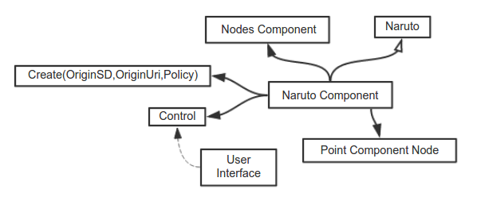
      
      类似于【复制构件】。
      
10. ##代替方案
   从【上面的设计】可以看出，如果【从头开始】设计【整个Naruto系统】，将非常的复杂，开发周期比较长，但是【Naruto系统】可以说是整个【云交易系统平台】中【软件部分】的【基石】，不可或缺。
   
   另外一种方法可以【减少】甚至【避免】大部分【基础模块】的【研发】，那就是【使用开源软件】辅助实现。接下来我将举出【可能采用】的【代替方案】以及需要使用的【开源软件】，这些方案可以【巨大程度】的【缩短开发周期】。
   
   当然，因为【开源工具】的使用，等于是在【理论系统】之上增加了一层【通过网络访问】的【中间层】，因此，【理论上】的【性能】和【效率】会要低一些。
   
   1. ###Nodes构件
      【Nodes模块】有个特点是【通讯两端】是【对等】的，并且允许【小概率】的【消息丢失】。
      
      【ZeroMQ/Nanomsg】可以代替【Nodes模块】实现节点之间的通讯，这两个工具是C写的，也是目前最贴近【Nodes模块】的设计，稍加包装就可以代替【Nodes模块】。
      
      另外，类似于Java里面的【Neitty】或者是基于C的【libev】，都可以作为实现【Nodes模块】的【底层】。
      
   2. ###复制构件
      【复制构件】实际上有两个功能，一是【自动选举Leader】，二是【副本容错】。
      
      1. ####自动选举Leader
         
         
         采用一个【分布协调系统】可以使【Leader的选举】非常简单。
         
         例如采用ZooKeeper，生成两个【文件节点】，一个代表【Leader锁】，一个是【Node Info】，当Nodes启动之后，只要有一个Node将【Leader锁】锁住，他就成为了Leader，直到这把锁超时。在Node成为Leader的时候可以通过Node Info判断【各个Node的状态】，这样可以实现【自动让贤】的功能。
         
      2. ####副本冗余
         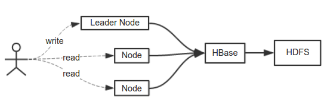
         
         如果能够忍受【稍微长点】的【延时】，集群后面架设【一个分布式文件系统】或者【一个分布式NoSQL数据库】就可以【免去】复制副本的【痛苦】。复杂的【案例】可以使用Hadoop项目中的HBase和HDFS来【备份数据】，简单的可以【根据情况】使用ZooKeeper或者FastDFS这样【较轻】的【分布式文件系统】。特别的，如果需要只是【最终一致性】还可以采用Cassandra，当然【分布式文件系统】只是作为【存档】用的，真正【运行时使用的数据】还是要Load到内存。
         
      更有开源组件【BookKeeper】以及【QJM】专门用来处理【日志同步】，几乎实现了【整个复制模块】。
      
   3. ###【切片构件】和【Naruto构件】
      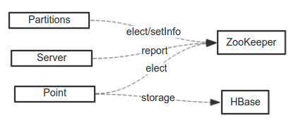
      
      最简单的方法可以是一个【选举好Leader的集群】由Leader将Node的【切分信息】放置于ZooKeeper上，因为【Naruto模块】的【代替方案】的【Repls层】本身就要使用【分布式存储】，所以【切分信息】相对简单，甚至不需要处理复杂的【数据移动】，在这儿ZooKeeper是可以承担的。