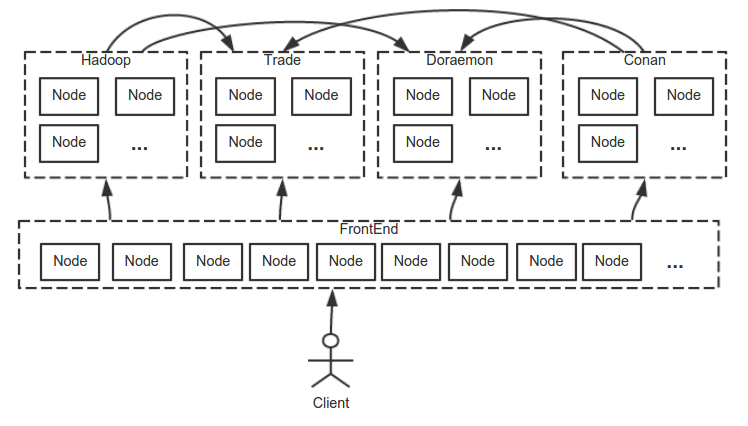
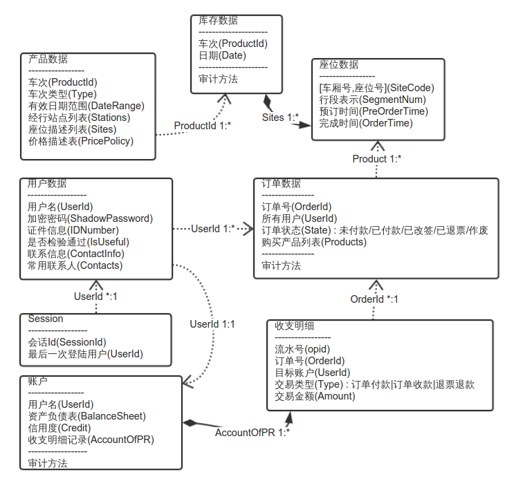
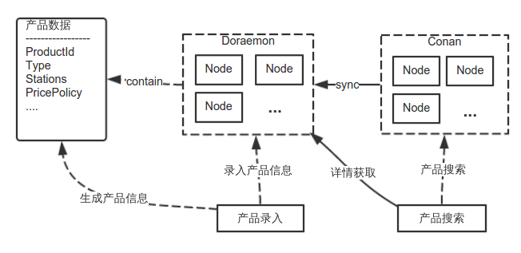
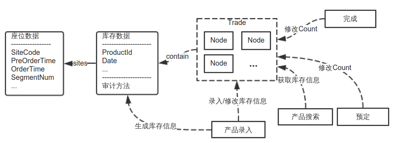
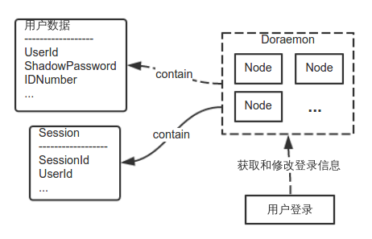
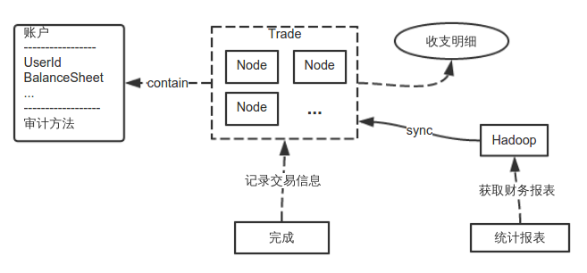
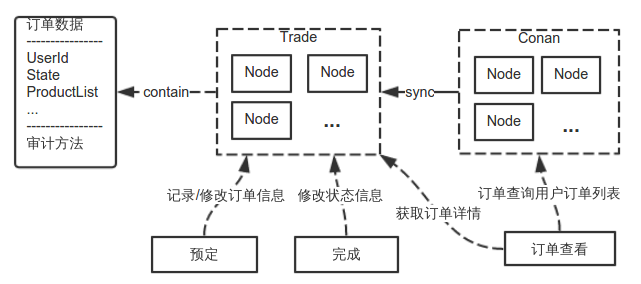

#云交易站点存储架构说明

1. ##前言
   本文简要介绍了采用【云交易平台】的【基础组件】，构建一个类似【12306网站】的【云交易站点】的技术规划和思路，在这个技术方案下，站点具有可支撑巨大的并发访问量以及高可用的特性，并可以随着业务量的增加，动态弹性的进行扩展。
   
   限于篇幅，本文只对该网站【基本数据与功能】和【整体架构】进行描述，【基础组件】的实现细节以及关于【PaaS】请参考另外几篇关于【云交易平台】的文章。
   
   本文会简要的对一些【基础组件】提出可选的快速实现方案，但从其他几篇文章可以看出，这些快速实现方案在大吞吐量的时候会造成系统延时增长，只适合初期快速开发。因此要发挥这些组件的最大能力，还需要同时开发这些组件的最终版，以便在系统后期可以容纳更大的吞吐量。
   
2. ##基础数据说明

   * **产品数据**： 列车的固有信息说明，比如是动车还是高铁或者普快等，列车发车时间周期，途径站点，计费标准等。
   * **库存数据**： 每趟列车上座位的使用信息，每个位子在每趟列车两个相邻站点之间都有一个唯一的库存。
   * **用户数据**： 用户的固有信息，包括姓名性别身份证号码等。
   * **财务数据**： 每个用户都有一个唯一的账户，账户会记录用户的资产负债表以及收支明细。系统自己也会有若干个财务账户。
   * **订单数据**： 用户预定座位之后会产生一个订单信息来跟踪本次交易的状态，比如未付款，已付款，已出票，已退票等。
   
3. ##基础操作说明

   * ###属于管理员的操作：
      * **产品录入**：管理员可以将列车以描述的方式录入系统，包括列车的产品信息和周期和库存信息。
      * **统计报表**：管理员可以查看或者导出一段时间的各种交易数据统计结果。
      
   * ###属于用户的操作：
      * **用户登录**： 注册的用户可以通过用户名ID和密码登录到系统。
      * **产品搜索**： 登录的用户可以搜索确定时间两地之间的可用列车表。
      * **订单查看**： 用户可以查看属于自己所有的订单列表和订单详情。
      * **预定**： 用户选择需要的列车班次和座位生成订单直到填写完信息的过程。
      * **完成**： 用户对预定的订单完成付款操作的过程。
      
4. ##全局架构说明
   
   
   
   本系统整体架构分为五个集群，一个【前端FrontEnd】，四个【后台BackEnd】。
   
   **FrontEnd**：前端，常规的Web站点，为客户提供可用浏览器访问的页面，页面由Controller访问后台动态生成。如果只有V和C，任何框架下的FrontEnd都天生具有可扩展性，建议采用Java社区的Tomcat。
   
   **Doraemon**： 【对象存储云服务】的项目代号，这个集群是完全去中心化具有最终一致性的对象存储，用来存储用户信息等不需要强一致性的数据，这个组件具备准实时同步接口，和亚马逊的Dynamo一样能进行弹性扩展，详情请看另外一篇文章《对象存储云服务》，前期建议采用【代替方法】以mongodb为底层快速实现，这种方式会使请求延时较长。
   
   **Trade**：【事务云服务】的项目代号，这个集群是强一致性的分布式事务处理系统，同时也是一个对象存储，用来存储需要进行事务处理的数据，并采用【审计】这种特有的方式高速批量的处理事务，这个组件同样具备准实时同步接口和高可扩展性，详情请看另外一篇文章《事务云服务》，前期建议采用【存储分离模型】以hadoop或者mongodb为底层快速实现，这种方式会使请求延时较长。
   
   **Conan**：【关系云服务】的项目代号，这个集群中【搜索云服务】是他的一个功能子集，可以通过Doraemon和Trade的同步接口同步源数据，并对多值属性进行索引，通过建立合适的索引，可以实现快速搜索功能，详情请看另外一篇文章《关系云服务》，前期可以采用Lucene对Doraemon进行扩展的方案快速实现【搜索云服务】功能子集。
   
   **Hadoop**：这个集群通过Doraemon和Trade接口同步Log数据，进行线下数据分析。
   
5. ##存储说明
   
   
   
   所有的业务数据都是以对象的形式存储于【分布式存储系统】中的，上图先将各数据的属性与12306中的部分名词一一对应上，然后将各对象之间的关系表现出来，虚线说明两个对象之间存在查询关系，实线说明对象是包含关系，即一个是另一个的成员对象。
   
   本系统所用数种【分布式存储系统】都类似于新兴的【分布式对象存储】或者【分布式NoSQL数据库】，摒除传统【关系型数据库】的束缚。比如【订单数据】中的【购买产品列表】又或者是【库存数据】中的【座位数据】，在传统【关系型数据库】表设计中可能会划分为两个不同的表分开存储，而在本文中，【购买产品列表】和【座位数据】分别是作为【订单数据】和【库存数据】中的成员对象跟父对象统一存储的。让存储系统只处理存储使得资源分配得到最大程度的优化。
   
   在网站实际运转中，各个不同环节的所受【负载】是不一样的，整个系统采用不同类型的【分布式存储系统】搭建起来，可以对每一个环节配备不同的资源，例如【产品数据】的存储量不大，而查询量非常巨大，订单的存储量和查询量将随着时间的推进越来越大。在本系统中，可以独立的对这些环节进行资源分配，以达到资源利用的最优化。
   
6. ##产品数据与操作
   
   
   
   **【产品数据】**的存储只需要满足观察者时间不可逆的最终一致性，因此可以采用【对象存储云服务Doraemon】集群来存储数据，同时将让【关系云服务Conan】集群实现Doraemon的Leaner接口，用来同步Doraemon中的数据，并准实时建立查询索引。
   
   **【产品数据】**是以对象的形式存储在Doaemon中的，最重要的字段是：ProductId是主键；Stations是行经站点列表，用来建立查询索引；PricePolicy是每种类型座位的价格策略用来确定最终价格。
   
   **【产品录入】**操作会将产品数据插入Doraemon集群中，这时Conan会检测到Doraemon中的数据发生变化，并将变化同步过来建立实时索引，用来提供给【产品搜索】进行车次查询和车次详情查询。PricePolicy用来在【产品搜索】时展示价格信息。
   
7. ##库存数据与操作
   
   
   
   **【库存数据】**需要满足各种事务操作的强一致性存储，因此可以采用【事务云服务Trade】集群来存储和处理数据，【库存数据】有一个【审计方法】提供给Trade进行批量事务处理。
   
   **【库存数据】**有三个主要的字段，ProductId和Date用来唯一标识一趟列车，Sites列表用来记录这趟列车上座位情况，Sites中重要的字段是：SiteCode表示座位号，PreOrderTime表示预定时间，OrderTime表示完成时间,SegmentNum表示属于某个行程段。
   
   **【产品录入】**的时候会将初始的数据插入到Trade中，或者对数据进行修改，【产品搜索】需要从Trade中获取某个班次当前可用座位数，【预定】和【完成】操作都需要对库存座位数据进行修改。
   
    所有修改操作都会由Trade服务进行处理，通过【审计方法】快速批量的完成。
    
8. ##用户数据与操作
   
   
   
   【用户数据】和【产品数据】一样之需要最终一致性存储，因此同样采用【对象存储云服务Doraemon】进行处理，不同的是，也许我们并不需要一个用户信息搜索，因此不必将Doraemon的用户数据同步到Conan中。
   
   用户数据中比较重要的字段是：UserId唯一标识一个用户，ShadowPassword是密码。
   
   在处理用户登陆的时候【Session数据】也是存储在Doraemon中的，比较重要的字段是：SessionId从浏览器传回，UserId标识上次登陆的用户。
   
   【用户登录】操作可以从Doraemon获取用户信息，并将Session的数据插入到Doraemon中。
   
9. ##财务数据与操作
   
   
   
   【财务数据】是非常重要的，每个用户都有一个账户，这个账户就保存有该用户的【财务数据】，因为【财务数据】同样需要进行各种事务操作，因此和【库存数据】一样，也用【事务云服务Trade】来存储。不同的地方是，有一个实现了Trade同步方法的Hadoop系统，他同步Trade中的数据和Log，以便提供基于批处理报表分析系统。
   
   【财务数据】中比较重要的字段是：UserId标识数据是哪一个用户的；BalanceSheet是资产负责表，表明该账户目前的资产情况；
   
   同时Trade系统本身就是一个基于Log的系统，在【财务数据】处理中，可以认为Log就是所有的【收支明细】。
   
   系统本身就会有若干个账户，和用户账户一起，每笔资金会从一个账户流动到另一个账户，而每一笔流入流出都会有记录，为对帐提供很好的依据。
   
   当订单【完成】的时候会要修改【财务数据】，这时应该Trade通过【审计方法】对多个账户同时进行处理。除此之外，其他对账户的修改操作也是通过Trade进行的，例如充值，转帐等。
   
10. ##订单数据与操作
   
   
   
   【订单数据】和【财务数据】一样需要支持各种事务操作，同样采用【事务云服务Trade】进行存储和事务处理，不同的是，Trade中的订单数据会准实时同步到【关系云服务Conan】集群中实现一个用户订单的聚合。
   【订单数据】比较重要的字段是：UserId表示订单属于哪个用户；State是订单状态；ProductList是预定产品列表，其中包括车次和座位号以及价格信息和乘客信息。为了支持Trade进行批量事务处理，也有一个【审计方法】。
   【预定】操作会将订单插入到Trade中，【完成】操作会通过Trade修改订单状态，【订单查看】操作会从Conan中获取本用户的订单列表，或者从Trade中获取订单详情信息。
   