1. ##前言

2. ##相关模型和相关引擎
   万事万物之间都有关联，本节将建立一个描述各事物之间相互关系的模型，并描述一个系统可以将相关性进行管理和查询的系统。
   
   1. ###相关模型
      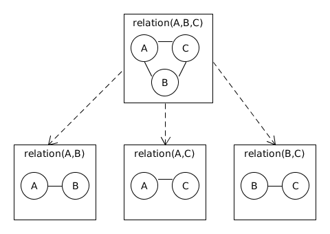

      * 如图，有三个集合 A B C，可以通过一个方法判断两两之间的某个元素是否相关，那么选取其中的元素 a b c，如果判断出 ab ac bc 都相关，那么我们可以认为 a b c 是相关的。如果只有 AB 和 BC 存在相关性，那么可以通过判断 ab 和 bc 是否相关来确定 abc 是否相关。
      * 可以将上面的例子推广：
         1. 集合 F {F(1),F(2),...,F(n)} 为源集合, 其中 F() 为数据集合, 对于 F ,其中每个 F() 中选取的任意一个对象 组成 f {f(1),f(2),...,f(n)} 元素集合, 其中 f() 为元素。
         2. f 任选 x 个对象的组合 y(x) {y(x,1),y(x,2),...,y(x,C(x,n))} 为x元集合, 其中 y(x,) 命名为 x元子, 可以预见 y(1)===f .
         3. 在 y(2) 中选择 m 个 y(2,) 组成 d { d(1),d(2),...,d(m) } 为主可判2元子集合, d() 为可判2元子.
         4. 函数集合 L {L(1,),L(2,),...,L(m,)} 为二元相关函数集合, L(,)为二元相关函数，对每个  L(i,d(i)) 可得一个 [0,1] 的值，这个值说明 d(i) 包含的两个元素之间在 L 上的相关量.
         5. 主相关二元子集合 p { p(1),p(2),...,p(w) } 是 d 的子集, 是由 d 中在 L 上的相关量都大于最小相关量 v 的对象组成.
         6. 对于y(x,)中的x个元素, x 中选2组成 q {q(x,,1),q(x,,2),...,q(x,,c(2,x)} 为待判x元子集合, q(x,,)为待判x元子, 如果q中的对象在d中出现就必然也在p中出现,则y(x,)为相关x元子. y(x) 中为相关x元子的对象组成集合 g(x) { i<=C(x,n)|g(x,1),g(x,2),...,g(x,i) } 为y(x) 的相关x元子集合. 并可以预见当x=2的时候, g(2)===p(2).
          

   2. ###相关引擎【Conan】
      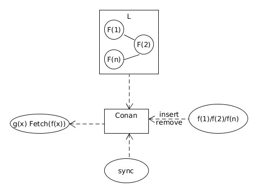

      本文设计的相关引擎可以快速的根据预设的若干个数据集之间的关系查询相关的数据：
         1. 以相关函数集合L作为输入。
         2. 可以插入和删除L中描述的数据集合，系统会对数据进行存储和索引。
         3. 可以根据某个数据集中的元素快速查询包含这个元素的相关x元子集合。
         4. 可以查询符合某个条件的相关x元子集合.
		 4. 系统提供同步相关元子集合变化的通道.
      当然，真实系统会随着n的个数增加而计算量剧烈增长，因此实际应用中会限制n的个数，并将数据分片存储。
	   

3. ##相关性的分层结构
   为了能够使Conan存储并索引到A集合中各个子集合之间的关系，并能快速根据条件查询任何一个符合L的子集，我们将相关模型分层构建。
   
   1. ###三个数据集合
      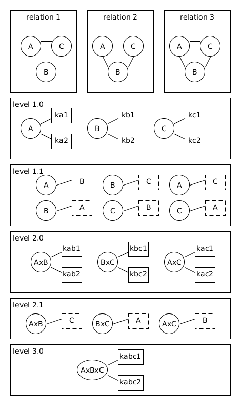
	  
      **我们先看一个三个集合的例子，A B C 为三个集合中的某个元素，根据两两之间可能存在或者不存在相关性, 分为三种情况:**
	     1. relation1 情况下，只有AC可以判断相关性, 则 ABC 三者不可能相关, 而 AC 则可能相关。
	     2. relation2 情况下, ABC 三者可能相关, AB BC 可能相关, 但 BC 不可能相关.
	     3. relation3 情况下, ABC三者可能相关, 同时AB AC BC也可能相关，上图是relation3的分层结构。

      **我们详细描述一下第三种情况下的分层情况:**
	     1. level 1.0 是单独为a b c建立一系列的关键字索引, 这一层与普通的搜索引擎类似, 但是将建立多个属性的倒排索引.
	     2. level 1.1 将为所有可能的二元关系建立索引,比如 a 将可以通过 b 快速查出.
	     3. level 2.0 将为相关二元子建立关键词索引.
	     4. level 2.1 将为每个相关二元子建立到相关三元子的索引.
	     5. level 3.0 为相关三元子建立关键词索引.
	   

   2. ###更普遍的,我们给出一般情况下层的情况.
      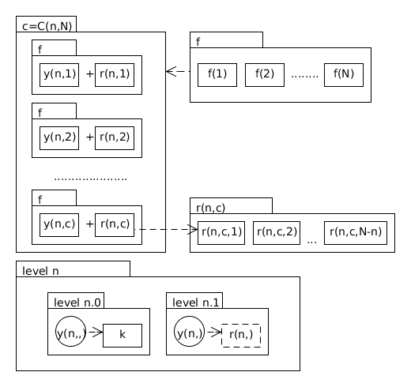

	  1. 如果集合个数为 N ,整体则分为 N 大层，从 leve 1 ~ leve N。
	  2. 第 n 层处理相关n元子的索引情况，如 level 1 处理单个数据集合的情况，而 level 2 处理 相关2元子集合的情况。
	  3. 每个大层分为两个小层 leve n.0 level n.1。
	  4. 0小层为关键词索引层，关键词索引可以快速的根据某个查询条件查出该层相关n元子,同时为构建1小层的提供预查.
	  5. 1小层为推进索引层，记录该层相关n元子和不在这个组合中的元素的相关性。
	  6. 特别的，对于最后一层，只有0小层，没有1小层，最后一层不需要再往下推进了。
	   

4. ##层的操作
   1. ###第n层必备操作函数
      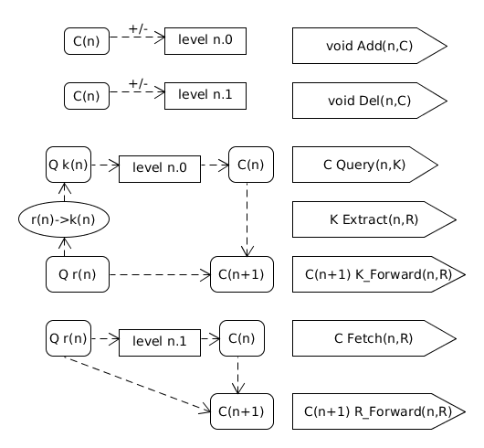
	  
      Conan的每个Level都要支持7个基本的操作,对于Level n:
	  1. 支持 Add 操作, 可以添加一个相关n元子, 这个操作会在内部调用 K\_Forward 操作, 并将结果放入管道流中.
	  2. 支持 Del 操作, 可以删除一个相关n元子, 这个操作会在内部调用 R\_Forward 操作, 并将结果放入管道流中.
	  3. 支持 Query 操作, 可以采用关键词条件查询一个相关n元子集合.
	  4. 支持 Extract 操作, 可以给定一个元素, 构造出n层上的某个相关n元子集合的关键词条件.
	  5. 支持 K\_Forward 操作, 这个操作实际上是Query和Extract的组合,可以在level n.0中查询与某个元素相关的相关n元子,并推导出包含该元素的相关n+1元子集合.这个操作的特点是作为查询条件的元素可以并不在系统里面.
	  6. 支持 Fetch 操作, 可以给定一个元素, 然后查询与这个元素相关的相关n元子的集合.
	  7. 支持 R\_Forward操作, 这个操作是 Fetch 操作的再封装, 和 K\_Forward 类似, 可以在level n.1 中导出包含该元素的相关n+1元子集合, 这个操作的特点是作为查询条件的元素必须在系统中, 这个操作相对 K\_Forward 更快.
	   

   2. ###Conan的插入操作
      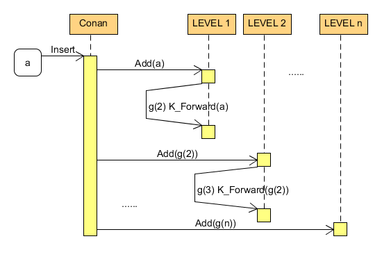

      当要向Conan插入一个元素a的时候, Conan 会首先调用Level 1的 Add 方法将数据插入 Level 1 层, Add方法会返回对于a来说属于 Level 2 的相关2元子集合g(2), 然后Conan会将g(2)调用 Level 2 层的 Add 方法, 如此循环直到 Level n 层.
	    

   3. ###删除操作
      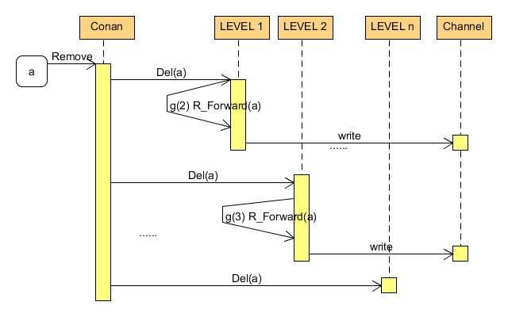

      当向Conan删除一个元素a的时候, Conan 会先调用Level 1的 Del 方法将Level 1层的数据删除,同时 Del 会返回跟 a 相关的 Level 2 的相关2元子集合g(2), 然后 Conan 会将g(2)调用 Level 2 层的 Del方法, 循环往复直到 Level n 层.

   至于 Add 和 Del 返回的下一个 Level 的数据如何取得, 因为我们有监控每一层相关n元子的变化的管道, 因此, 下层可以直接监听上层的同步管道.

5. ##存储和查询框架
   

   相关引擎是倒排索引在某个应用领域的推广, 是准实时的检索系统, 因此存储和查询的实现方式非常重要, 系统需要满足大量的实时数据修改和查询, 从修改到能查到结果之间的时间尽可能短, 因此整体的存储架构与 LSM Tree 结构非常相似, 只是将 LSM Tree 推广到倒排索引存储之上.

   上面相关性的分层架构中, 每一层都有若干个倒排索引, 下面我将针对单个索引进行描述.
   1. 将整个存储结构分为若干层{B0,B1,...,Bn},其中B0和B1在内存中,其它的在磁盘上,除了B0之外,其余的各层都不能实时修改,对数据进行修改的时候,先存放于B0层,在B0层达到一定的大小的时候,B0层自动转为B1层,而B1层将下降到B2层,其余的依次如此.
   2. 索引有一个顺序写的操作Log, 任何对数据的修改将先写入Op Log中, Disk和Mem都有一个指针指向Op Log, 当系统奔溃的时候, Memory部分将从Disk的cur指针处进行恢复, 而Memory的cur指针用来记录最后一次操作的地方.
   4. 数据绝大多数都存储在Disk的各个层里面, 当条件允许的时候, 会选取两个层进行合并, 例如选取 Bn-1和Bn, 在线下进行合并为一个新的Bn-1层, 合并完成之后将替换原来的Bn-1和Bn.
   5. 修改数据的时候, 先会在B0层中生效, 删除的数据会在B0中进行记录, 时间的变化, 最新的数据永远在上层.
   6. 对于在Disk上的数据, 会有一个根据热度失效的Cache进行缓存, 因为除了B0之外,其它的层不允许实时修改, 这样的Cache将非常容易实现.
   8. 查询数据的时候, 从上层往下开始查询, 因为最新的数据永远在上层, 查到数据可以立即返回, 这时可以采用bloom filter进行优化. 因为查询到的结果是排好序的, 因此符合查询可以很轻松进行归并.
    

6. ##检索结构
   之前说过, Conan是倒排索引在某个领域的推广, 跟常规的 LSM Tree不同的是, 在各层合并的时候, 不但要合并Dict, 还要合并DocList, 拿leveldb来打比方, 就是不但要合并key, 还要合并value, 在本节将对倒排索引关键的两个部分DocList和Dict进行描述. 每个结构都会说明在内存和磁盘上有何不同.

   1. ###DocList的结构
      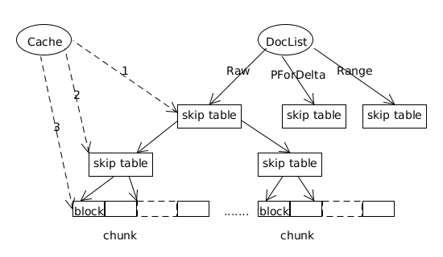

	  在Conan中,DocList是巨量的,怎么将一大批DocId尽可能的压缩, 而且不会严重的影响查询性能是关键. 考虑到Conan存储的分层形式, DocList采用利于合并的形式是比较好的, 因此可以采用一个二元组进行排序 sn(rank, docid).
	  * 在内存时, 由于要处理DocId新增的情况并且要兼顾合并, 因此需要两个有序数列, 一个是sn2docid\_list, 用来按sn顺序索引docid. 一个是docid2sn\_list, 用来按docid顺序索引sn. 这两个数列可以采用skiplist或者是rbtree来实现. 另外, 当从B0转到B1时, docid2sn\_list数列可以放弃, 只保留按sn排序的结果.
	  * 当存储到磁盘上时, 只在层合并的时候删除DocId, 因此可以按sn采用顺序结构存储, 由于绝大多数的DocId都在磁盘上, 需要采用一些压缩的手段, 一个DocList可以被分为三个部分:
	     1. Raw部分
		    无法进行压缩的DocId存放在这个部分中. 这个部分是一个排好序的Array, 里面放置的是裸的(rank, docid).
	     2. PForDelta部分
	        这个部分将对一些紧凑的区间采用PForDelta算法进行压缩.
	     3. Range部分
	        这个部分将对连续的区间值保存起始和结尾的位置.

	    上面三个部分都会对sn的高位rank进行压缩, 例如存一个rank->pos的表.
         

   2. ###Dict的结构
      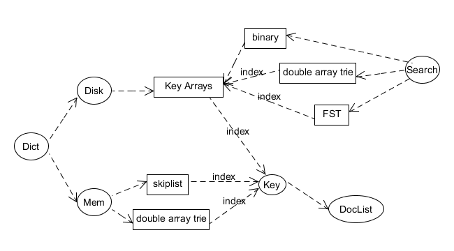

	  Conan的Dict会剧烈的变化,因此各层的Dict也需要排序,并且不断的做合并.Dict无论在内存和Disk中都采用跳跃表的形式存储, 值得一提的是, DocList中的skip table其实也是一种跳跃表.不论是在磁盘上还是在内存中,Dict可以仿照DocList的Raw段来进行.
   
   3. ###Doc2Segment结构

7. ##检索结构的合并
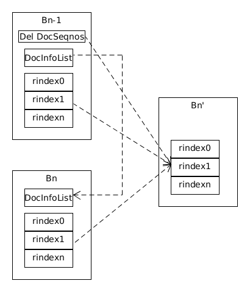
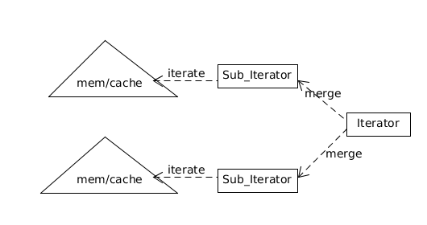
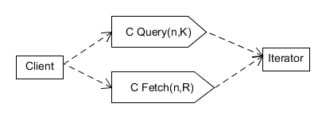

8. ##分片与归并
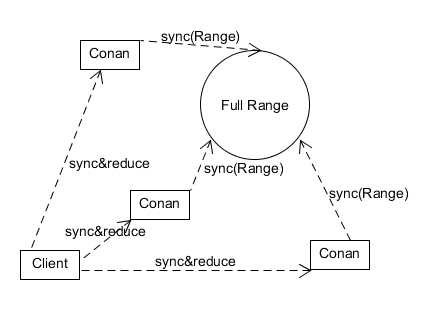

9. ##折中方案